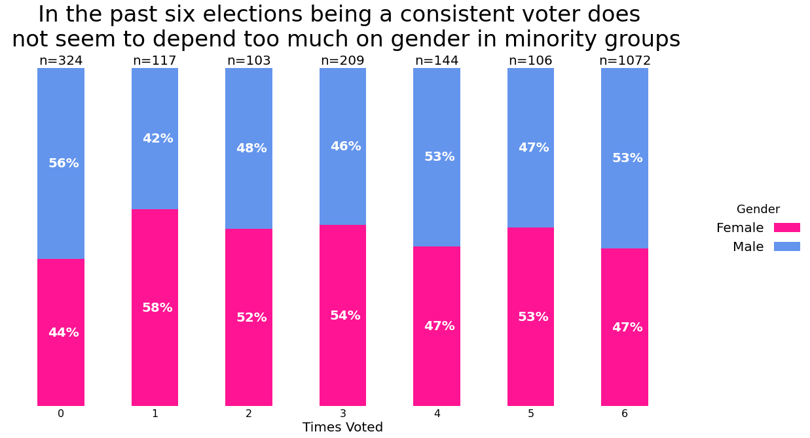

# Data Visualization Spring 2022 Final Project
## Voting, Gender, and Income

## Project Question: How do income and the number of times someone has been eligible to vote change with gender within minority groups?

### Introduction

My project seeks to explore how income and the number of respondents who vote when they are eligible change with 
gender in minority groups. 
In every election up to 60% of eligible voters choose not to cast a ballot. But what does that look like underneath the surface? Through a series of plots
this webpage will explain how eligible minority voters who do/do not vote change with factors such as gender and income. 

### Data Cleaning and Processing

Log of preprocessing steps for data visualization final project:
• For the columns that show whether someone voted in a particular election, I removed 
all the observations where the question was skipped taking our total number of 
observations from 5836 to 5721. I then only kept the rows in the race column with 
values 'Black', 'Other/Mixed', 'Hispanic'. This reduced my dataset to 2075 observations.

• To turn the categorical income column into numerical data I could more easily work with 
I made a few changes. 
For income levels 'Less than $40k', those values were reclassified as an integer equal to $39,999.
For income levels between'$40-75k', those values were reclassified as an integer equal to $75,000.
For income levels between'$75-125k', those values were reclassified as an integer equal to $124,999.
For income levels '$125k or more', those values were reclassified as an integer equal to $125,000.

• To calculate the total times an individual voted I looked at all the relevant question 
columns (Q27) then converted all the ones to ‘Yes’. I then summed all the results across 
rows to get the total amount of times someone voted. Lastly, with regard to recycled code from prior assignments; to produce
some of my visualizations I repurposed my multi stack bar function from assignment 5.

### Visualizations

s

s

s

The first visualization reveals that in the last 6 elections being a consistent voter does not 
depend much on gender when looking at the minority subset as a whole. This result was boring 
so I further subset the data to look at how gender changed among people who indicated that 
they have voted every time they were eligible by utilizing the voter_category column. The 
values in this column are ['always', 'sporadic', 'rarely/never'].
Among those that voted every time they were eligible, females significantly outperformed 
males. In other words, among people that indicate that they always vote whenever eligible, 
females tend to vote more than males in minority groups. For the rest of the project I will 
explore other ways these two variables can be looked at and also I will be using the income 
category to create additional visualizations. The final product might be a github website.

