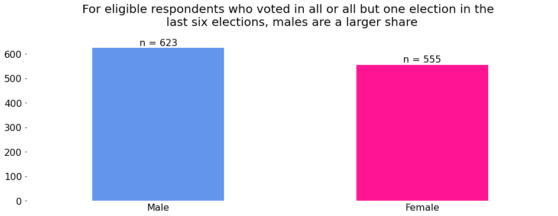

# Data Visualization Spring 2022 Final Project
## Voting, Gender, and Income

## Project Question: How do income and voter eligibility change with gender within minority groups?

## Introduction

My project seeks to explore how income and the number of respondents who vote when they are eligible change with 
gender in minority groups. 
In every election up to 60% of eligible voters choose not to cast a ballot. But what does that look like underneath the surface? Through a series of plots
this webpage will explain how eligible minority voters who do/do not vote change with factors such as gender and income. 

## Data Cleaning and Processing

Log of preprocessing steps for data visualization final project:
For the columns that show whether someone voted in a particular election, I removed 
all the observations where the question was skipped taking our total number of 
observations from 5836 to 5721. I then only kept the rows in the race column with 
values 'Black', 'Other/Mixed', 'Hispanic'. This reduced my dataset to 2075 observations.

To turn the categorical income column into numerical data I could more easily work with 
I made a few changes: 

    For income levels 'Less than $40k', those values were reclassified as an integer equal to $39,999.
    For income levels between'$40-75k', those values were reclassified as an integer equal to $75,000.
    For income levels between'$75-125k', those values were reclassified as an integer equal to $124,999.
    For income levels '$125k or more', those values were reclassified as an integer equal to $125,000.

To calculate the total times an individual voted I looked at all the relevant question  columns (Q27) then converted all the ones to ‘Yes’. I then summed all the results across rows to get the total amount of times someone voted. Lastly, with regard to recycled code from prior assignments; to produce some of my visualizations I repurposed my multi stack bar function from assignment 5.

Here is some information as to what the voter category column values stand for

VOTER_CATEGORY:

    always: respondent voted in all or all-but-one of the elections they were eligible in
    sporadic: respondent voted in at least two, but fewer than all-but-one of the elections they were eligible in
    rarely/never: respondent voted in 0 or 1 of the elections they were eligible in

## Visualizations

The first visualization reveals that in the last 6 elections being a consistent voter does not 
depend much on gender when looking at the minority subset as a whole. This visualization is also based on a respondents total amount of votes cast in the last six elections. 
This result was boring so I further subset the data to look at how gender changed among people who indicated that 
they have voted every time they were eligible by utilizing the voter_category column. The 
values in this column are ['always', 'sporadic', 'rarely/never']. 

This second plot shows which gender voted at least 5 or more times in the last elections. Males here seem to have been recently outperforming women.
In other words, without controlling for income, among people that voted at least five times in the last six elections, 
males tended to vote more than females in minority groups. 

The third plot shows the distribution of the four different income groups in the dataset by gender. The data here ultimately shows that from the poorest 
to the richest groups across genders, more women than males indicate that they always vote when eligible. This is slightly in contrast with what the previous plot shows. However it could just be that in the last 6 elections more women were not eligible to vote due to specific factors.
For example, someone who moves and subsequently changes their address, is not eligible to vote until they re-register.
However, if they voted all those other times when they were eligible then they would still be correct in saying that they always vote whenever eligible which may explain why the previous plot shows the outperformance of men. Other reasons someone may lose their eligibility to vote include being convicted of a felony or people who are mentally incapacitated.

Lastly the fourth plot shows voting patterns among respondents based on gender and income. By observing the blue bar in each subplot we can see that proportionately more women voted in all or all but one of the elections they were eligible in. Among the highest earners the proportion of males and females that almost vote is almost identical. 
On the other side of the spectrum, in the lowest income category proportionately more males than females rarely/never vote. One area where the males proportionately outperform the females is in the upper middle income's ($75-125k) sporadic voting category.

## Conclusion

Now let's circle back to the project question of "How do income and voter eligibility change with gender within minority groups?". 
It seems that in the recent years men outperform
However if we step back and only look at respondents voting behavior when they are eligible to vote then we observe a different result...

